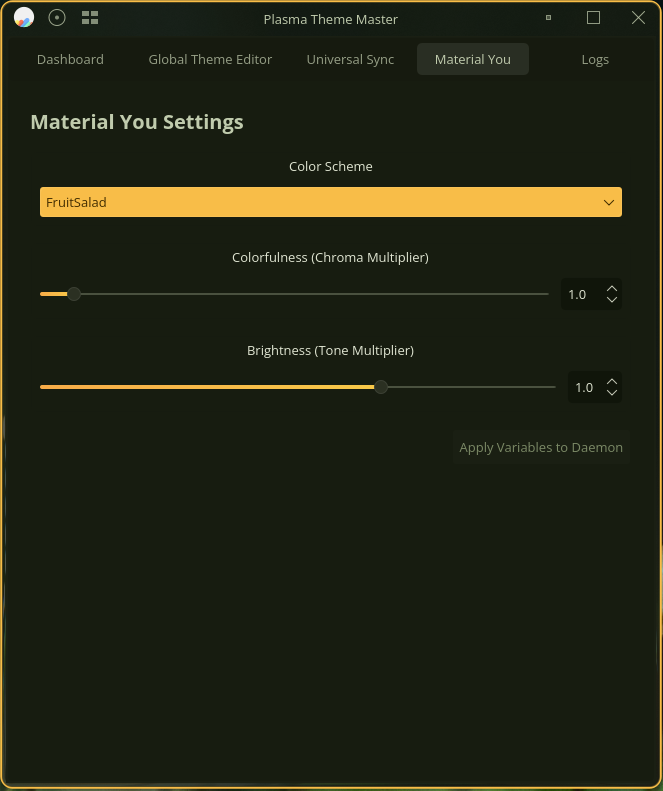
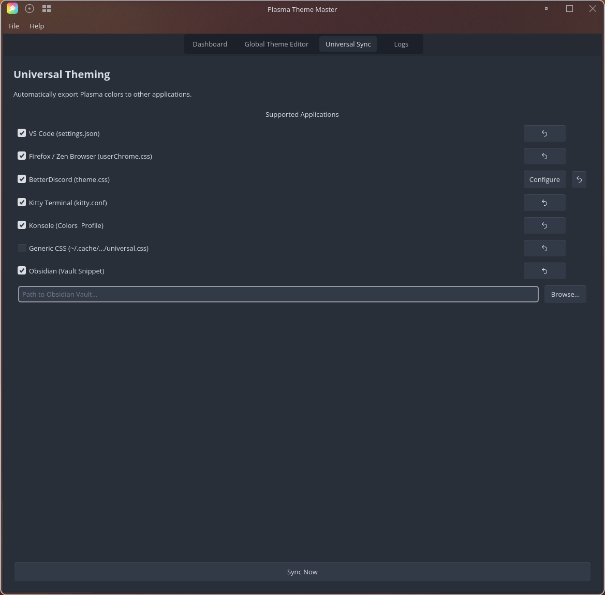

# Plasma Theme Master

**Version 2.0.3**

Plasma Theme Master is a simple utility that unifies the native and non-native plasma theming tools in a single application, a functional gui with a cli backend supporting it. The daemon runs in the background to perform the scheduled changes in an unobtrusive manner.

KDE Plasma recently introduced users to a native Day/Night cycle that automatically switches your desktop theme between Day and Night modes. This application allows you to set custom kvantum themes for day or night mode as well as custom gtk themes for day or night mode so that you can maintain a cohesive aesthetic across your system. It also features a robust Global Theme Editor for customizing and backing up global themes in case you like some parts of a global theme but not others. (example: I want the Breeze Global theme but I would like it to always use the tela icon theme and the breeze dark window decorations, the Global Theme Editor can make those edits seem easy and intuitive).

Over time, Plasma Theme Master has added ways to integrate with other applications to allow for a "one stop shop" for easy theme management, and occasionally to extend day/night cycle functionality to these other applications. These third party tools are amazing, so please support those developers however you can. 

## Features

- **Automatic Day/Night Switching**: Seamless transition of Global, Kvantum, GTK, Flatpak themes, Klassy Window Decorations, and Material You Color Schemes (with optional temporary override auto-restoration).
- **Native Night Color Integration**: Automatically reads KDE Plasma's Night Color settings directly via D-Bus for perfectly synchronized Day/Night transitions.
- **Solar Calculation Fallback**: Acts as a smooth fallback system, automatically calculating sunrise and sunset times based on longitude and latitude if Night Color is inactive.
- **Independent Day/Night Solar Offsets**: Shift sunrise (Day) and sunset (Night) transitions earlier or later independently via GUI sliders or CLI (supporting negative offsets to trigger modes earlier than solar transitions).
- **Klassy Integration**: Apply window decoration presets (Day/Night) automatically.
- **Material You Integration**: Automatically generate and apply Material You based color schemes on theme switch using `kde-material-you-colors`.
- **Global Theme Editor**: Customize theme components (Plasma Style, Window Decorations, Icons, etc.) with ease.
- **Backup & Restore**: Automatically backs up theme defaults and allows one-click restoration.
- **Universal Theme Sync** (v2.0.0 — Template System): Syncs Plasma colors to other apps using a matugen-style template engine. Supports VS Code/Antigravity, Firefox/Zen, BetterDiscord, Vencord, Kitty, Konsole, Zed Editor, Btop, Vicinae, and Obsidian. Each app uses a standalone `.tpl` file — fully customizable. Custom template entries can be added freely to `config.toml`.
- **Theme Sync**: Keeps Kvantum, GTK, Klassy, and Flatpak themes in sync with your Global Theme.
- **Daemon Mode**: Runs efficiently in the background to monitor time changes and swap to the correct themes. Lightweight and resource efficient.
  - Daemon: ~2MB Memory Usage
  - GUI App: ~50MB Memory Usage
- **Logging**: Centralized, log file with GUI viewer.

## Screenshots

| Dashboard | Global Theme Editor |
| :---: | :---: |
|  |  |
| **Material You Settings** | **Universal Theme Sync** |
|  |  |

## Installation

### Prerequisites
- KDE Plasma 6.5+
- Qt 6
- CMake
- KConfig, KCoreAddons
- pipx (required for installing Material You dependencies)
- Flatpak (optional, for Flatpak support)
- Klassy Window Decoration (optional, for window decoration preset switching)

### Easy Install Script:

1. Clone the repository:
   ```bash
   git clone https://github.com/SonOfMithras/plasma-theme-master.git
   cd plasma-theme-master
   ```

2. Run the installation script:
   ```bash
   ./install.sh
   ```
   This script will check for missing dependencies on Ubuntu and Arch based systems, then request the users permission to install the dependencies and build the application, by default it will install it to `/usr/bin`, and register a systemd user service.

### NixOS Support (Experimental)

A `flake.nix` is provided for experimental support on NixOS. You can try it with:
```bash
nix run github:SonOfMithras/plasma-theme-master
```
> [!WARNING]
> NixOS support is currently **incomplete and experimental**. It is not yet recommended for daily use as some paths or integrations (like systemd user services) might behave differently than expected.

## Usage

### GUI
Launch the application from your application menu or terminal:
```bash
plasma-theme-master
```
- **Dashboard**: View system status, sun times, set Klassy presets, enable Material You overrides, and manually override themes.
- **Global Theme Editor**: Select a global theme, edit its components, and save changes.
- **Flatpak Settings**: Manage Flatpak theme integration (Help -> Flatpak Settings...).
- **Material You Colors**: Install, upgrade, and toggle autostart for the Material You generator (Help -> Material You Colors).
- **Check for Updates**: Check for new releases directly from the Help -> About dialog.
- **Logs**: View application logs for debugging.

### CLI Commands
The application provides a comprehensive Command Line Interface (CLI) for scripting and advanced usage.

| Command | Description |
|---|---|
| `status` | Show current solar times, mode, active themes, and configured day/night offsets. |
| `day` | Force switch to Day mode (respects temporary override auto-recovery). |
| `night` | Force switch to Night mode (respects temporary override auto-recovery). |
| `set-offset-day <minutes>` | Set daytime offset in minutes (sunrise shift, supporting negative values). |
| `set-offset-night <minutes>` | Set nighttime offset in minutes (sunset shift, supporting negative values). |
| `set-reenable-auto <bool>` | Toggle auto-restoration of auto mode at the next scheduled cycle change. |
| `set-global-day <theme>` | Set the Global Theme for Day mode. |
| `set-global-night <theme>` | Set the Global Theme for Night mode. |
| `set-kvantum-day <theme>` | Set the Kvantum Theme for Day mode. |
| `set-kvantum-night <theme>` | Set the Kvantum Theme for Night mode. |
| `set-gtk-day <theme>` | Set the GTK Theme for Day mode. |
| `set-gtk-night <theme>` | Set the GTK Theme for Night mode. |
| `set-flatpak <theme>` | Instantly set the Flatpak GTK theme. |
| `set-flatpak-day <theme>` | Set the Flatpak theme for Day mode. |
| `set-flatpak-night <theme>` | Set the Flatpak theme for Night mode. |
| `set-flatpak-follow <bool>` | Toggle Flatpak syncing with GTK theme. |
| `flatpak-status` | detailed status of Flatpak integration. |
| `flatpak-setup` | Setup Flatpak permissions. |
| `clone-global <src> <dest>` | Clone a Global Theme to a new name. |
| `sync-universal` | Sync enabled universal apps immediately. |
| `sync-enable <app>` | Enable universal sync for an app (backups created). |
| `sync-disable <app>` | Disable universal sync for an app. |
| `sync-list` | List universal sync apps and their status. |
| `sync-restore <app>` | Restore an app configuration from backup. |
| `log [-n lines] [--errors]` | View application logs. |
| `daemon` | Run the background daemon (handled by systemd usually). |
| `uninstall` | Remove the application and service. |

### Universal Theme Sync
Plasma colors are injected into other apps via a template engine. Each app has a `.tpl` file and is configured in `~/.config/plasma-theme-master/config.toml`.

**Supported Apps**: `vscode` (Code/OSS/VSCodium/Antigravity), `firefox` (incl. Zen), `discord`/`betterdiscord`, `vencord`, `kitty`, `konsole`, `btop`, `vicinae`, `obsidian`, `zed`, `millennium` (Steam Material-Theme).

**Setup**:
1. Enable sync for an app (writes to `config.toml`):
   ```bash
   plasma-theme-master sync-enable vscode
   ```
2. Run sync:
   ```bash
   plasma-theme-master sync-universal
   ```
   Or click **Sync Now** in the Universal Theme tab.

**Custom Templates**: Add your own app to `config.toml`:
```toml
[templates.myapp]
enabled = true
input_path = '~/.config/plasma-theme-master/templates/myapp.tpl'
output_path = '~/.config/myapp/colors.conf'
palette = 'current'
post_hook = 'myapp --reload'
```

**Troubleshooting**:
- **VS Code**: Set WindowAutofdetect color scheme to 'enabled' in settings. Backups stored as `settings.json.bak`.
- **Firefox/Zen**: Requires `toolkit.legacyUserProfileCustomizations.stylesheets` set to `true` in `about:config`.
- **BetterDiscord/Vencord**: Enable the "PlasmaMaster" theme under BetterDiscord theme settings.
- **Obsidian**: Enable the "Plasma Master" snippet in Appearance settings.
- **Millennium (Steam)**: Overwrites `blue.css` to inject dynamic accent colors. Requires the Steam client modding framework [Millennium](https://steambrew.app/) and [Material-Theme](https://steambrew.app/theme?id=ipYjqODds05KMcvh7QJn) installed. In Steam's Material-Theme settings, the **Color** scheme must be set to **"Blue"**. Note: Live reloads are not automatically triggered by Steam, so a manual theme toggle or client refresh is required in Steam settings after synchronization to apply color changes.

## Tips & Tricks

- **Location Settings**: The application automatically retrieves your Latitude and Longitude from KDE Plasma's System Settings ("Day-Night Cycle" settings). You **must** have your location manually configured (longitude and latitude) in Plasma for the solar calculation to be accurate.
- **Backup Reset**: If you mess up a theme in the Editor, use the "Restore Original Defaults" button to revert to the state before you first edited it.
- **Service Control**: The background service is managed by systemd. You can control it manually if needed:
  ```bash
  systemctl --user status plasma-theme-master
  systemctl --user restart plasma-theme-master
  ```
- **Config Reset**: If the app misbehaves, you can reset all settings via `Help > Clear Config` in the GUI.

## Troubleshooting Build Issues

### Known Issues/Limitations

#### Universal Theme Sync
- Some CSS themes will only partially update automatically, Apply target on the Dashboard, and Sync target on the Universal Theme Sync tab will force the sync. Workshopping potential solutions.
- Konsole needs to be restarted to reflect the change in colors. Kitty works fine without a restart.

#### Material You Colors
- If generating colors immediately after clicking "Apply Target" while the daemon is actively running through a sync process, you might experience a slight delay before the material you script finishes updating the global scheme colors. The system will generally sort itself out within 2 seconds.

### Build Issues

If you encounter errors during the build process on Debian/Ubuntu-based systems (e.g., `CMake Error`, `missing header` files), you may be missing dependencies.

1. Install the required packages:
   ```bash
   sudo apt update
   sudo apt install build-essential cmake extra-cmake-modules qt6-base-dev qt6-declarative-dev libkf6config-dev libkf6coreaddons-dev libkf6colorscheme-dev pipx
   ```

2. Retry the installation script:
   ```bash
   ./install.sh
   ```

## Credits

**Author**: Ammar Al-Riyamy (SonOfMithras)
**GitHub**: [https://github.com/SonOfMithras](https://github.com/SonOfMithras)

## Accreditations

This project integrates with or was inspired by the following awesome projects:
- **BetterDiscord**: [https://betterdiscord.app/](https://betterdiscord.app/)
- **Vencord**: [https://vencord.dev/](https://vencord.dev/)
- **Koi** (KDE Day/Night Cycle concept inspiration): [https://github.com/baduhai/Koi](https://github.com/baduhai/Koi)
- **Matugen** (Material You Colors inspiration): [https://github.com/InioX/matugen](https://github.com/InioX/matugen)
- **Kvantum**: [https://github.com/tsujan/Kvantum/tree/master/Kvantum](https://github.com/tsujan/Kvantum/tree/master/Kvantum)
- **kde-material-you-colors**: [https://github.com/luisbocanegra/kde-material-you-colors](https://github.com/luisbocanegra/kde-material-you-colors)
- **Klassy**: [https://github.com/paulmcauley/klassy](https://github.com/paulmcauley/klassy)
- **Caelestia-dots**: [https://github.com/caelestia-dots/caelestia](https://github.com/caelestia-dots/caelestia)
- **ML4W Dotfiles**: [https://github.com/mylinuxforwork/dotfiles](https://github.com/mylinuxforwork/dotfiles)

## License
MIT License
