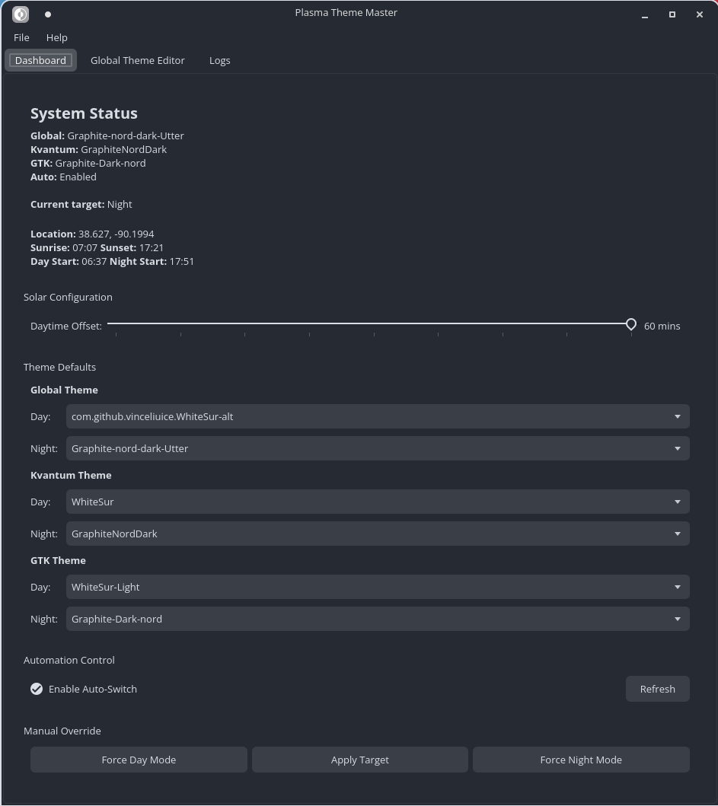
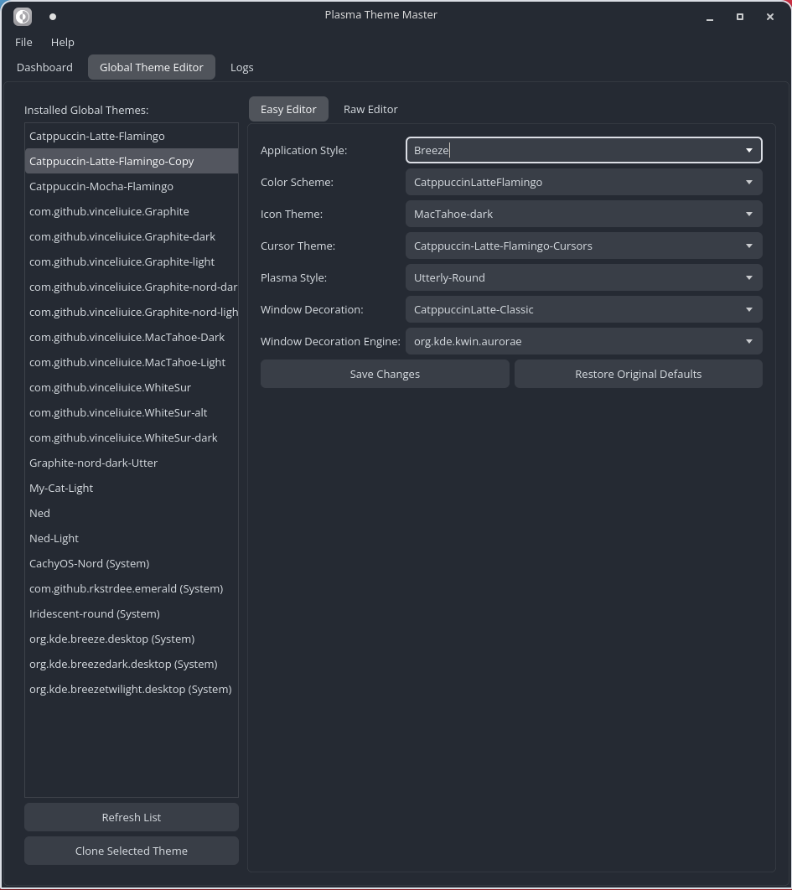

# Plasma Theme Master

**Version 1.1.0**

Plasma Theme Master is a simple utility that unifies the native and non-native plasma theming tools in a single simple application, a simple and functional gui with a cli backend supporting it. The included daemon runs in the background to perform the scheduled changes in an unobtrusive manner.

KDE Plasma recently introduced users to a native Day/Night cycle that automatically switches your desktop theme between Day and Night modes. This application allows you to set custom kvantum themes for day or night mode as well as custom gtk themes for day or night mode so that you can maintain a cohesive aesthetic across your system. It also features a robust Global Theme Editor for customizing and backing up global themes in case you like some parts of a global theme but not others. (example: I want the Breeze Global theme but I would like it to always use the tela icon theme and the breeze dark window decorations, the Global Theme Editor can make those edits seem easy and intuitive).

## Features

- **Automatic Day/Night Switching**: seamless transition of Global, Kvantum, GTK, and Flatpak themes.
- **Solar Calculation**: Automatically calculates sunrise and sunset times based on the long and lat provided to vial plasma's integrated day/night cycle.
- **Solar Offset**: I noticed that plasma switched my global theme 30 mins after sunset so I added an offset to allow manual adjustment to sync with the time plasma acctually changes the theme.
- **Global Theme Editor**: Customize theme components (Plasma Style, Window Decorations, Icons, etc.) with ease.
- **Backup & Restore**: Automatically backs up theme defaults and allows one-click restoration.
- **Theme Sync**: Keeps Kvantum, GTK, and Flatpak themes in sync with your Global Theme.
- **Daemon Mode**: Runs efficiently in the background to monitor time changes and swap to the correct themes. Lightweight and resource efficient.
  - Daemon: ~2MB Memory Usage
  - GUI App: ~50MB Memory Usage
- **Logging**: Centralized, log file with GUI viewer.

## Screenshots


*Dashboard View*


*Global Theme Editor*


## Installation

### Prerequisites
- KDE Plasma 6
- Qt 6
- CMake
- KConfig, KCoreAddons
- Flatpak (optional, for Flatpak support)

### NixOS Support (Experimental)

A `flake.nix` is provided for experimental support on NixOS. You can try it with:
```bash
nix run github:SonOfMithras/plasma-theme-master
```
> [!WARNING]
> NixOS support is currently **incomplete and experimental**. It is not yet recommended for daily use as some paths or integrations (like systemd user services) might behave differently than expected.

### Building from Source

1. Clone the repository:
   ```bash
   git clone https://github.com/SonOfMithras/plasma-theme-master.git
   cd plasma-theme-master
   ```

2. Run the installation script:
   ```bash
   ./install.sh
   ```
   This script will build the application, install it to `/usr/bin`, and register a systemd user service.

## Usage

### GUI
Launch the application from your application menu or terminal:
```bash
plasma-theme-master
```
- **Dashboard**: View system status, sun times, and manually override themes.
- **Global Theme Editor**: Select a global theme, edit its components, and save changes.
- **Flatpak Settings**: Manage Flatpak theme integration (Help -> Flatpak Settings...).
- **Check for Updates**: Check for new releases directly from the Help -> About dialog.
- **Logs**: View application logs for debugging.

### CLI Commands
The application provides a comprehensive Command Line Interface (CLI) for scripting and advanced usage.

| Command | Description |
|---|---|
| `status` | Show current solar times, mode, and active themes. |
| `day` | Force switch to Day mode (applies configured Day themes). |
| `night` | Force switch to Night mode (applies configured Night themes). |
| `set-global-day <theme>` | Set the Global Theme for Day mode. |
| `set-global-night <theme>` | Set the Global Theme for Night mode. |
| `set-kvantum-day <theme>` | Set the Kvantum Theme for Day mode. |
| `set-kvantum-night <theme>` | Set the Kvantum Theme for Night mode. |
| `set-gtk-day <theme>` | Set the GTK Theme for Day mode. |
| `set-gtk-night <theme>` | Set the GTK Theme for Night mode. |
| `set-flatpak <theme>` | Instantly set the Flatpak GTK theme. |
| `set-flatpak-day <theme>` | Set the Flatpak theme for Day mode. |
| `set-flatpak-night <theme>` | Set the Flatpak theme for Night mode. |
| `set-flatpak-follow <bool>` | Toggle Flatpak syncing with GTK theme. |
| `flatpak-status` | detailed status of Flatpak integration. |
| `flatpak-setup` | Setup Flatpak permissions. |
| `clone-global <src> <dest>` | Clone a Global Theme to a new name. |
| `log [-n lines] [--errors]` | View application logs. |
| `daemon` | Run the background daemon (handled by systemd usually). |
| `uninstall` | Remove the application and service. |

## Tips & Tricks

- **Location Settings**: The application automatically retrieves your Latitude and Longitude from KDE Plasma's System Settings ("Day-Night Cycle" settings). You **must** have your location manually configured (longitude and latitude) in Plasma for the solar calculation to be accurate.
- **Backup Reset**: If you mess up a theme in the Editor, use the "Restore Original Defaults" button to revert to the state before you first edited it.
- **Service Control**: The background service is managed by systemd. You can control it manually if needed:
  ```bash
  systemctl --user status plasma-theme-master
  systemctl --user restart plasma-theme-master
  ```
- **Config Reset**: If the app misbehaves, you can reset all settings via `Help > Clear Config` in the GUI.

## Troubleshooting Build Issues

If you encounter errors during the build process on Debian/Ubuntu-based systems (e.g., `CMake Error`, `missing header` files), you may be missing dependencies.

1. Install the required packages:
   ```bash
   sudo apt update
   sudo apt install build-essential cmake extra-cmake-modules qt6-base-dev qt6-declarative-dev libkf6config-dev libkf6coreaddons-dev
   ```

2. Retry the installation script:
   ```bash
   ./install.sh
   ```

## Credits

**Author**: Ammar Al-Riyamy (SonOfMithras)
**GitHub**: [https://github.com/SonOfMithras](https://github.com/SonOfMithras)

## License
MIT License
